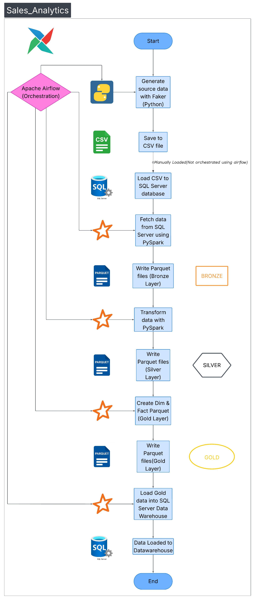

#### Authored By: [Kaustav Kumar Das](https://www.linkedin.com/in/kaustav-kumar-das-b39a75152/)

#### Last Updated On: 02nd February 2026
## 🧠 Project Overview
This project ingests transactional sales data from SQL Server tables, transforms it using **PySpark**, and loads it into a **SQL Server Data Warehouse** 
following the **Medallion Architecture (Bronze → Silver → Gold)**. The intermediate files are stored in **parquet** format. The source data here has been created using **Faker Python** Code.
This data is generated in **csv** format and then loaded to **SQL Server Database** in the source tables. **Apache Airflow** is used to orchestrate the ELT pipeline.

## 🏗️ Architecture
#### Medallion Layers

| Layer   | Purpose                                      | Storage Format            | Destination                                                  |
|---------|----------------------------------------------|---------------------------|--------------------------------------------------------------|
| Bronze  | Raw ingestion from SQL Server source tables  | Parquet                   | Bronze folder (opt/airflow/data/Bronze)                      |
| Silver  | Cleaned, deduplicated, enriched data         | Parquet                   | Silver folder (opt/airflow/data/Silver)                      |
| Gold    | Aggregated business-level tables for analytics | Parquet and SQL Server DW | Gold folder(opt/airflow/data/Gold) and Data Warehouse (SQL)  |

#### Tools Used

| Component        | Technology            | Purpose                                                                                                   |
|------------------|-----------------------|-----------------------------------------------------------------------------------------------------------|
| Orchestration    | Apache Airflow        | Manages DAGs, schedules jobs, and orchestrates ELT pipeline execution                                     |
| ELT Engine       | PySpark               | Performs extraction, transformation, and loading of large-scale data                                      |
| Source Database  | SQL Server            | Provides transactional source tables for ingestion                                                        |
| Intermediate Storage | csv and Parquet Files | Raw data generated as csv. Parquet Stores Bronze, Silver and Gold layer data in efficient columnar format |
| Target Warehouse | SQL Server DW         | Hosts Gold layer tables for analytics and reporting                                                       |
| Version Control  | Git/GitHub            | Tracks code changes and enables collaboration                                                             |
| Documentation    | Markdown (`.md`)      | Provides project overview, architecture, and usage instructions                                           |

## 📊 Architecture Diagram

## 🗃️ Data Model

## ⚙️ Airflow DAGs
- **datagen** : Creates synthetic source data files(csv) using Faker(Python Code)
- **sales_analytics** : This includes all the pyspark code orchestration flow.(Bronze → Silver → Gold → Publish (sql Server) for sales analytics)

## 🚀 Deployment
**Steps to deploy in local:**
[docs/How_to_run_in_local_env.md](docs/How_to_run_in_docker_env.md)

**Steps to deploy in docker:**
[docs/How_to_run_in_docker_env.md](docs/How_to_run_in_docker_env.md)

