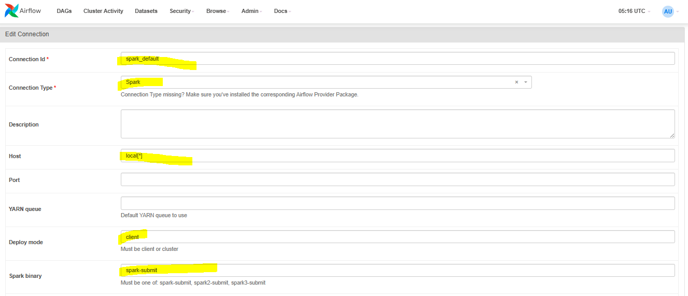
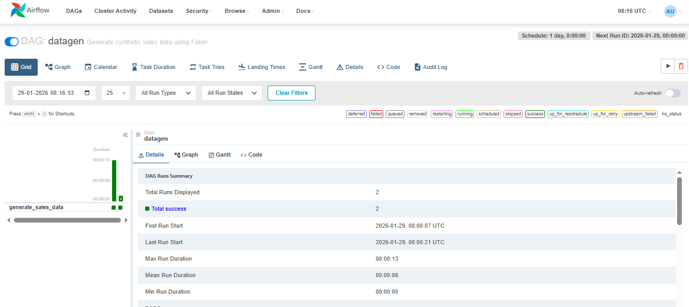
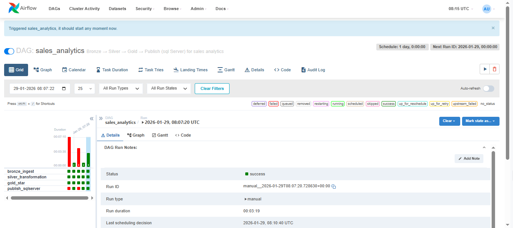

**Steps to run in docker environment:**

To install Docker Desktop with WSL2 on Windows 10, you need to first enable WSL2, 
install a Linux distribution, and then install Docker Desktop configured to use the WSL2 backend. 
This ensures you can run Linux-based containers seamlessly on Windows.

**🛠 Step 1: Check System Requirements**
- Windows 10 version: Must be 2004 or later (Build 19041+).
- Virtualization: Enable virtualization in BIOS/UEFI.
- Hardware: 64-bit processor with virtualization support.

**🛠 Step 2: Install WSL2**
- Open PowerShell as Administrator.
- Run:
wsl --install
- This installs WSL and sets WSL2 as default.
- If you already have WSL1, upgrade with:
wsl --set-default-version 2
- Restart your computer.
- Install a Linux distribution (e.g., Ubuntu) from the Microsoft Store.
👉 Verify installation:
wsl --list --verbose
You should see your distro with Version 2.

**🛠 Step 3: Install Docker Desktop**
- Download Docker Desktop for Windows from Docker’s official site (docker.com).
- Run the installer and follow prompts.
- During setup, ensure “Use WSL2 instead of Hyper-V” is selected.
- After installation, restart your computer.

**🛠 Step 4: Configure Docker Desktop with WSL2**
- Open Docker Desktop → Settings.
- Go to General → check “Use the WSL2 based engine”.
- Go to Resources → WSL Integration → enable integration with your installed Linux distro (e.g., Ubuntu).
- Apply & restart Docker Desktop.

**🛠 Step 5: Verify Installation**
- Open PowerShell or CMD:
docker --version
- Run a test container:
docker run hello-world
- Inside WSL (Ubuntu terminal):
docker ps
⚡ Common Issues & Fixes
- Blank docker command in WSL → Ensure Docker Desktop WSL integration is enabled.
- Performance issues → Allocate more CPU/RAM in Docker Desktop → Settings → Resources.
- Networking issues → Restart WSL (wsl --shutdown) and Docker Desktop.

✅ After these steps, you’ll have Docker Desktop running with WSL2 on Windows 10, 
allowing you to build and run Linux containers natively. 

**🛠 Step 6: Setting up the Dockerfile and docker-compose.yml file**
- Create the Dockerfile.(refer file in project)
- Create the docker-compose.yml.(refer file in project)

**🛠 Step 7: Building the image of airflow and installing all dependencies(java,spark etc) required**
- Run this command in your project directory terminal- "docker build --no-cache -t my-airflow ."

**🛠 Step 8: Start and run all the services defined in your docker-compose.yml file**
- Run this command in your project directory terminal- "docker-compose up"

**🛠 Step 9: Open browser and go to http://localhost:8080/, this is the airflow login page. 
User would be "admin" and password can be found out in the container file 
structure(/opt/airflow/standalone_admin_password.txt)**

**🛠 Step 10: Setup spark_default variable as below(e.g, http://localhost:8080/connection/edit/48)**

**🛠 Step 11: Run the jobs sequentially as mentioned**

- Run the **datagen** DAG to generate the source data files
(which will be used to insert the raw source tables).
When generated locally in windows line endings come as **CRLF**(ROWTERMINATOR = **'\n'** in bulk insert statement)
In this case,when generated in docker(linux) line endings come as **LF**(ROWTERMINATOR = **'0x0A'** in bulk insert statement)

- Run this script(sql/SourceTableDDL,DML.sql) in your local sql server database( After creating Sales_Analytics Database).
This would create the source tables and fill the data in those tables using the files we generated earlier.
- Run this script(sql/TargetTableDDL.sql) in your local sql server database( Sales_Analytics Database-Already created earlier).
This would create the target dimension and fact tables.
- Run the **sales_analytics** DAG to run the whole pyspark orchestration flow.(Bronze → Silver → Gold → Publish (sql Server) for sales analytics)

- Finally run these to validate data in the sql server tables:
select * from dw.FactSales;
select * from dw.DimCustomer;
select * from dw.DimDate;
select * from dw.DimProduct;
select * from dw.DimStore;

**🛠 Step 12: Stop the Docker Airflow container**
- Run this command in your project directory terminal- "docker-compose down"

